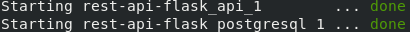
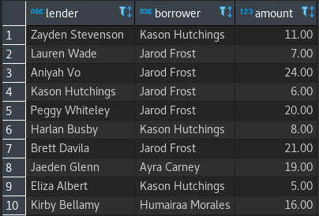

# Flask API and PostgreSQL Environment

## Overview

This repository's an example of environment that could be build using Flask API and PostgreSQL.

## Installation

Requirements:

* [Docker](https://docs.docker.com/v17.09/engine/installation/)
* [Docker Compose](https://docs.docker.com/compose/install/)

## Running

To start the environment, it's just need to run:

```
docker-compose up -d
```

In a few seconds the services will start:



## Services

There are two services included in the environment:

* Flask API: 
    * Connection:
        * Host: localhost
        * Port: 5000
* PostgreSQL: 
    * Connetions:
        * Host: localhost
        * Port: 5432
    * Authentication:
        * User: admin
        * Password: admin
    * Database: api
    * Table: money_control

## Default Data

The PostgreSQL table has a default data, with 60 examples, like bellow:



## Requests

### POST Method

* Add new lend registration:
    * <div style="display: inline">http://localhost:5000/api/post/add?<span style="color:yellow">lender</span>&<span style="color:yellow">borrower</span>&<span style="color:yellow">amount</span></div>

    Example:
    ```
    http://localhost:5000/api/post/add?lender=Joao&borrower=Maria&amount=33.33
    ```

### GET Method

* Get lender currently balance:
    * <div style="display: inline">http://localhost:5000/api/get/balance?<span style="color:yellow">lender</span></div>

    Example:
    ```
    http://localhost:5000/api/get/balance?lender=Joao
    ```

* Get lender transactions:
    * <div style="display: inline">http://localhost:5000/api/get/lender?<span style="color:yellow">lender</span></div>

    Example:
    ```
    http://localhost:5000/api/get/lender?lender=Joao
    ```

* Get lender list:
    * <div style="display: inline">http://localhost:5000/api/get/lenders</div>

    Example:
    ```
    http://localhost:5000/api/get/lenders
    ```

* Get all database table:
    * <div style="display: inline">http://localhost:5000/api/get/table</div>

    Example:
    ```
    http://localhost:5000/api/get/table
    ```